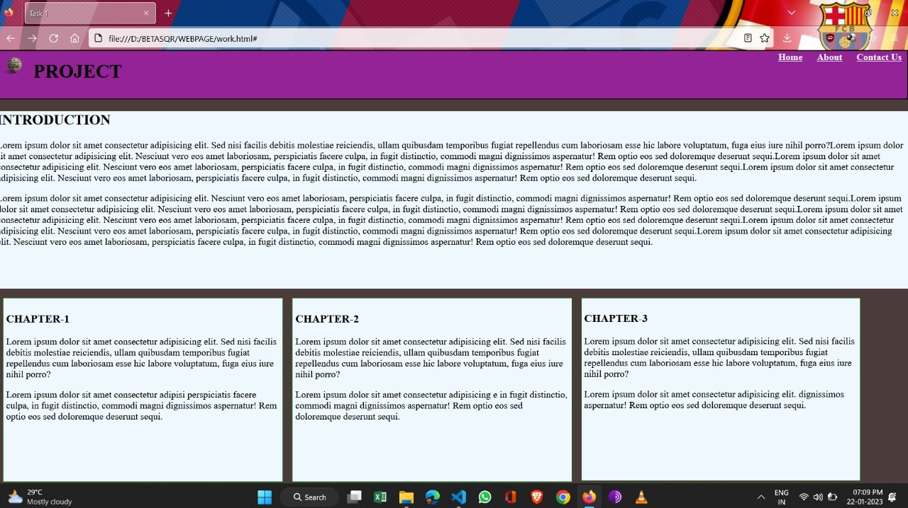

# betasquirrel-tasks

## Task

| Requirments                |  Output                     |
| ---------------------------|-----------------------------|
| | |
| | |
| | |

## Git commands
| Commands    |   Discription                         |
| ------------|---------------------------------------|
| `git config`|Configure git user                     |
| `git clone` | Clone a repo to local                 | 
| `git status`| Display the state of working directory|
| `git add`   | Add file changes to git               |  
| `git commit`| Commit changes to git                 |
| `git push`  | Push local commit to remote repo      |