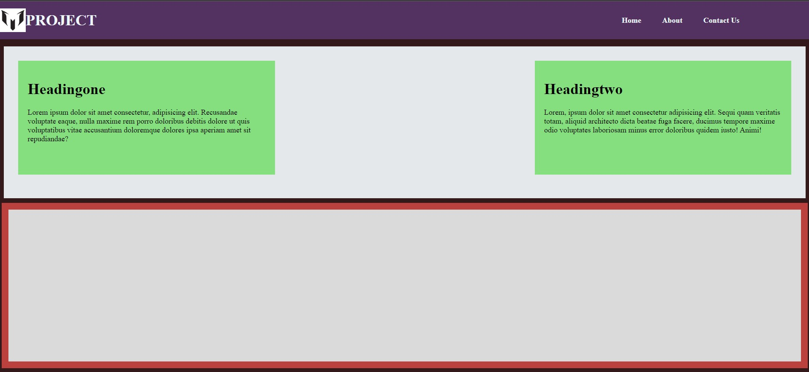

# betasquirrel-tasks

## Demo

[Live](https://musavirk.github.io/betasquirrel-tasks/)

## Task

| Requirments                           | Output                          |
| ------------------------------------- | ------------------------------- |
|  |  |
|     |  |
|     |  |

## Git commands

| Commands     | Discription                            |
| ------------ | -------------------------------------- |
| `git config` | Configure git user                     |
| `git clone`  | Clone a repo to local                  |
| `git status` | Display the state of working directory |
| `git add`    | Add file changes to git                |
| `git commit` | Commit changes to git                  |
| `git push`   | Push local commit to remote repo       |

## Linux commands

- `cd` change directory
- `ls` listvthe contents of a directory
- `pwd` provide current working directory
- `mkdir` make directory
- `rmdir` remove directory

## W3 SCHOOL

Read the below links

- [HTML HOME](https://www.w3schools.com/html/default.asp)
- [HTML Introduction](https://www.w3schools.com/html/html_intro.asp)
- [HTML Editors](https://www.w3schools.com/html/html_editors.asp)
- [HTML Basic](https://www.w3schools.com/html/html_basic.asp)
- [HTML Elements](https://www.w3schools.com/html/html_elements.asp)
- [HTML Attributes](https://www.w3schools.com/html/html_attributes.asp)
- [HTML Headings](https://www.w3schools.com/html/html_headings.asp)
- [HTML Paragraphs](https://www.w3schools.com/html/html_paragraphs.asp)
- [HTML Styles](https://www.w3schools.com/html/html_styles.asp)
- [HTML Formatting](https://www.w3schools.com/html/html_formatting.asp)
- [HTML Quotations](https://www.w3schools.com/html/html_quotation_elements.asp)
- [HTML Comments](https://www.w3schools.com/html/html_comments.asp)
- [HTML Colors](https://www.w3schools.com/html/html_colors.asp)
- [HTML CSS](https://www.w3schools.com/html/html_css.asp)
- [HTML Links](https://www.w3schools.com/html/html_links.asp)
- [HTML Images](https://www.w3schools.com/html/html_images.asp)
- [HTML Id](https://www.w3schools.com/html/html_id.asp)
- [HTML Classes](https://www.w3schools.com/html/html_classes.asp)

## Task 5

- [HTML Favicon](https://www.w3schools.com/html/html_favicon.asp)
- [HTML Tables](https://www.w3schools.com/html/html_tables.asp)
- [HTML Table Borders](https://www.w3schools.com/html/html_table_borders.asp)
- [HTML Table Sizes](https://www.w3schools.com/html/html_table_sizes.asp)
- [HTML Table Headers](https://www.w3schools.com/html/html_table_headers.asp)
- [HTML Table Padding & Spacing](https://www.w3schools.com/html/html_table_padding_spacing.asp)
- [HTML Table Colspan & Rowspan](https://www.w3schools.com/html/html_table_colspan_rowspan.asp)
- [HTML Table Styling](https://www.w3schools.com/html/html_table_styling.asp)
- [HTML Table Colgroup](https://www.w3schools.com/html/html_table_colgroup.asp)
